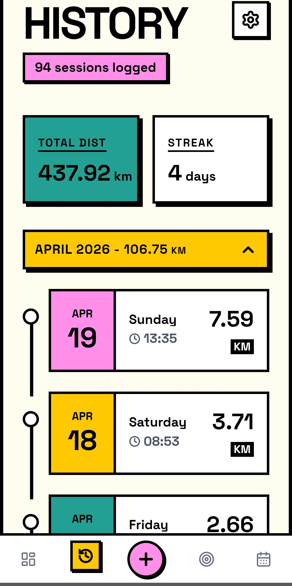

# 🚶‍♂️ StrideTrack

100% vibe code

**Note:** Please note that there are still features that have not yet been installed, but the app works perfectly fine.

A user-friendly Android app (.apk) designed to help you track your walks, set personal goals, and keep track of them. The app is built with a focus on seamless mobile user experience.

> **Note:** StrideTrack now supports **Google Health Connect**! You can automatically sync walking and hiking sessions directly from smartwatches (like Garmin, Samsung Galaxy, and Fitbit) or companion apps without manual entry.

---

## 📸 Screenshots

<div align="center">
  
    &nbsp;&nbsp;&nbsp;&nbsp;
  
</div>
<br />
<div align="center">
  
    &nbsp;&nbsp;&nbsp;&nbsp;
  
</div>

<br />
<div align="center">
  
  &nbsp;&nbsp;&nbsp;&nbsp;
  
</div>
<br />
<div align="center">
  &nbsp;&nbsp;&nbsp;&nbsp;
  
  

</div>

---

## ✨ Features

- **📊 Dashboard:** Get a full overview of your daily, weekly, and monthly progress directly on the front page.
- **🎯 Goals:** Set personal goals for how much you want to walk per week, month, and year, and track how close you are to reaching them.
- **📝 Log Walk:** Easy and quick logging of the distance you've walked on your latest trips.
- **📅 History:** Coming in the next version.
- **⚙️ Settings:** Customize the app to your needs and easily delete your data.
- **📱 Android App (.apk):** Built as a native app via Capacitor, ready to install on your Android phone.

## 🔒 Data & Privacy

StrideTrack is built with a 100% focus on user privacy and data ownership, employing a **Local-First with Opt-In Cloud Sync** philosophy:

- **Local-First by Default:** Everything you enter (how far you walk, times, goals, preferences) is saved **locally on your own phone**. The app works 100% offline and does not require an account to use. No one else has access to your local data.
- **Voluntary Cloud Backup (Opt-In):** We have integrated a secure, voluntary cloud backup system using **Supabase**. If you choose to connect a profile, your walk logs and goals will be automatically backed up in the cloud, protecting your history from physical device loss or app deletion.
- **Database-Level Protection:** When using cloud sync, your data is secured at the lowest database engine level using PostgreSQL **Row-Level Security (RLS)**. Only your authenticated user account has permission to read, write, or modify your walking data.
- **Offline / Local Backups:** If you prefer not to use the cloud, you can still manually export and import your complete walking history as a local backup file at any time via the settings.

## 🛠️ Technologies

The project is built with modern web technologies to ensure the best performance and experience:

- **Frontend Framework:** React 18
- **Programming Language:** TypeScript
- **Styling:** Tailwind CSS (with custom color themes)
- **Build Tool:** Vite
- **Icons:** Lucide React
- **Mobile/Native App:** Capacitor (Built for Android / APK)

## 🚀 Getting Started (Run Locally)

To run the project locally on your own machine:

1. **Clone the project:**
   ```bash
   git clone https://github.com/KS71/WalkGoal.git
   ```
2. **Enter the folder:**
   ```bash
   cd WalkGoal
   ```
3. **Install dependencies:**
   ```bash
   npm install
   ```
4. **Start the app:**
   ```bash
   npm run dev
   ```

## 👨‍💻 Development & History

**v2.3.8:**
- **Anonymous Usage Tracking:** StrideTrack now sends a tiny, fully anonymous ping (event type + timestamp only) when the app is opened or a walk is logged, so the developer can see whether the app is actually being used. No personal data, device ID or location is ever included, and it can be disabled per-device under Settings → Developer → Exclude This Device From Stats.
- **Android Release Build Hardening:** Release builds now enable code minification and resource shrinking, reducing app size and improving obfuscation.

**v2.3.6:**
- **Fixed Stalled Health Connect Imports:** The workout query relied on the plugin's default cap of 100 records, which returns only the *oldest* 100 sessions in range. Once a user had more than 100 workouts in their sync window, no new walks were imported at all. The query now pages through every session, and the window is capped at 90 days to keep it cheap.
- **Fixed 0 km Imports:** Distance is now read from Health Connect's distance records directly. The plugin requests distance and active calories in a single aggregate call, which always failed with a SecurityException because StrideTrack intentionally does not hold the calories permission — silently discarding the distance along with it.
- **No More Double-Counted Walks:** When the same walk is recorded by both a watch and the phone, only the more trustworthy source is kept. Sources are ranked (Garmin, Polar, Strava above Samsung Health, Fitbit and Google Fit), and overlapping sessions from lower-ranked sources are discarded.
- **Health Connect Diagnostics:** New Diagnose button under Settings → Integrations reports permission status, every session Health Connect returns with its type, time, distance and source, and whether each one was imported, skipped or previously deleted.

**v2.3.5:**
- **Fixed Goal Input:** The distance goal field can now be cleared completely instead of leaving a stubborn "0" behind, which previously caused values like "010" when typing a new goal. Tapping the field also selects the current value so it can be overwritten directly.
- **Save Confirmation:** Saving a goal now shows a clear "Goal saved" banner. Previously the confirmation was wiped instantly by a state refresh, making it look like nothing happened and prompting repeat taps.

**v2.3.3:**
- **New App Icon:** Refreshed the app with a brand new StrideTrack launcher icon and matching splash screen.
- **Rebranding:** Renamed the app package to `com.stridetrack.app` to fully align with the StrideTrack brand.
- **Cleaner Health Connect Permissions:** Removed all unused Health Connect permissions, keeping only distance and workout access.

**v2.3.1:**
- **Danger Zone / Delete All Data:** Added a secure option in Settings to permanently delete all local walks, goals, and settings with dual confirmation prompts.
- **Official Website Link:** Added a direct "Visit Website" link to [stridetrack.fit](https://stridetrack.fit) under the Settings Support section.
- **Streamlined Health Connect Permissions:** Optimized read permissions by removing step and calorie tracking from Health Connect integration to focus purely on high-fidelity distance and workouts, reducing permission overhead.
- **Removed Goal Step Estimates:** Simplified goal setup and walks by tracking pure distance, removing estimated step counts.

**v2.3.0:**
- **Google Health Connect Integration:** Automatically sync walks and hikes directly from smartwatches (Garmin, Samsung, Fitbit) and companion apps.
- **Selective Source Filtering (No Double-Counting):** Prioritizes GPS smartwatch distance over phone background step sensors to prevent double-counting.
- **De-duplication & Local Deletion Memory:** Prevents duplicates with deterministic ID mapping and remembers deleted Health Connect activities so they do not reappear on subsequent syncs.
- **In-App English Setup Guide:** Added a step-by-step setup and troubleshooting guide explaining connections and permission management.
- **Direct System Settings Shortcuts:** Easily adjust, grant, or revoke individual Health Connect permissions directly from the Settings menu.
- **Weekday Formatting:** Formats synced walks with matching generic weekday titles (e.g. "Wednesday") to align with manual logs.

**v2.2.1:**
- **Press-and-Hold Deletion:** Replaced the touch-swipe-to-delete item gesture on History with an elegant, responsive press-and-hold (long press) gesture. This completely avoids touch conflicts with side-swipe page navigation.
- **Improved Spacing Layout:** Decreased vertical empty space on the History tab between the header tip and the stats cards row for a more compact and readable mobile display.

**v2.2.0:**
- **Cloud Sync Integration:** Securely back up all your walking logs, goals, and settings in the cloud using Supabase. Logs are seamlessly synchronized between device local storage and your database.
- **Double Password Verification:** Added confirmation input on registration modal to ensure accurate profile password setup.
- **English Localization:** Translated and standardized all new Settings UI elements, modals, and synchronizing workflows to match the rest of the application.
- **Local Data Backup Clarity:** Refined Settings category and descriptions to clearly distinguish local file backups from cloud sync.

**v2.1.6:**
- **Swipe Navigation:** You can now smoothly swipe left and right to navigate between the different pages in the app.

**v2.1.5:**
- **Yearly Overview:** All months now consistently show the distance walked.
- **History:** Monthly group headers now turn green when the goal for that month is reached.
- **Settings:** Removed Daily Reminders. Updated the Roadmap to include Google Health Connect Integration.

**v2.1.4:**
- **Monthly History Grouping:** Walks in the History tab are now automatically grouped by month with collapsible sections.
- **Monthly Totals:** Each month now displays the total distance walked directly in the header.
- **Auto-Expand:** The most recent month is automatically expanded for quick access.

**v2.1.3:**
- Added the ability to manually select the time of the walk instead of defaulting to 'Now'.
- Implemented a festive "Goal Reached" graphic when progress reaches 100% or more.

**v2.1.1:**
- Added Settings navigation to sub-headers (Log Walk, Goal Setup, History).
- Added Last Backup date display with 12h/24h format support in Settings.
- Added a brand new Yearly Overview Statistics screen.
- Improved header styling across all pages to prevent overlap with the Android status bar.
